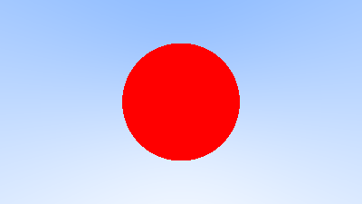
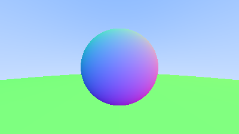
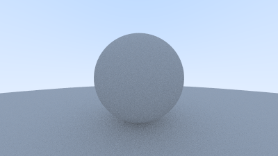
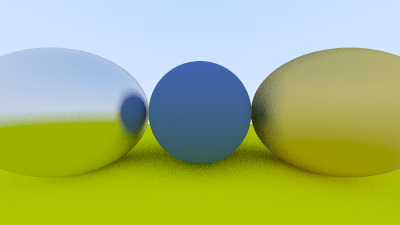
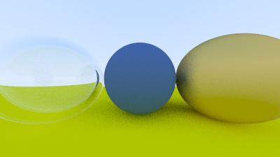
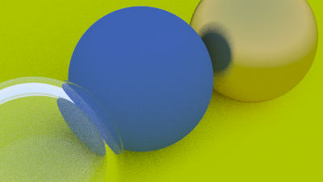
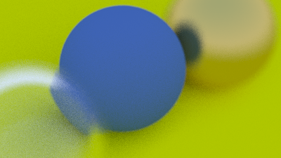
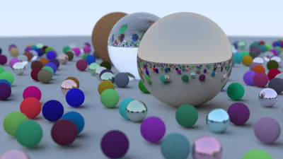

# Ray Tracing in One Weekend in Python 

[Ray Tracing in One Weekend](https://raytracing.github.io/books/RayTracingInOneWeekend.html) rewritten in python. Each step has been committed.

## Step 1: Output an Image, Rays, a Simple Camera, and Background

## Step 2: Adding a Sphere

## Step 3: Surface Normals and Multiple Objects

## Step 4: Antialiasing

## Step 5: Diffuse Materials

## Step 6: Metal

## Step 7: Dielectrics

## Step 8: Positionable Camera

## Step 9: Defocus Blur

## Step 10: Final scene

